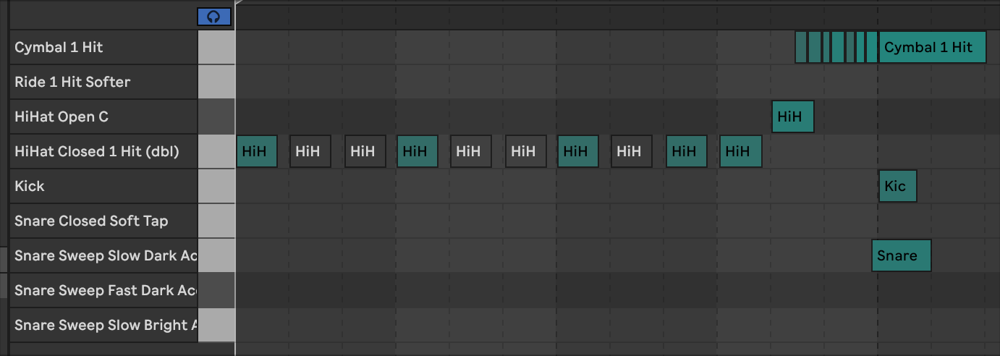
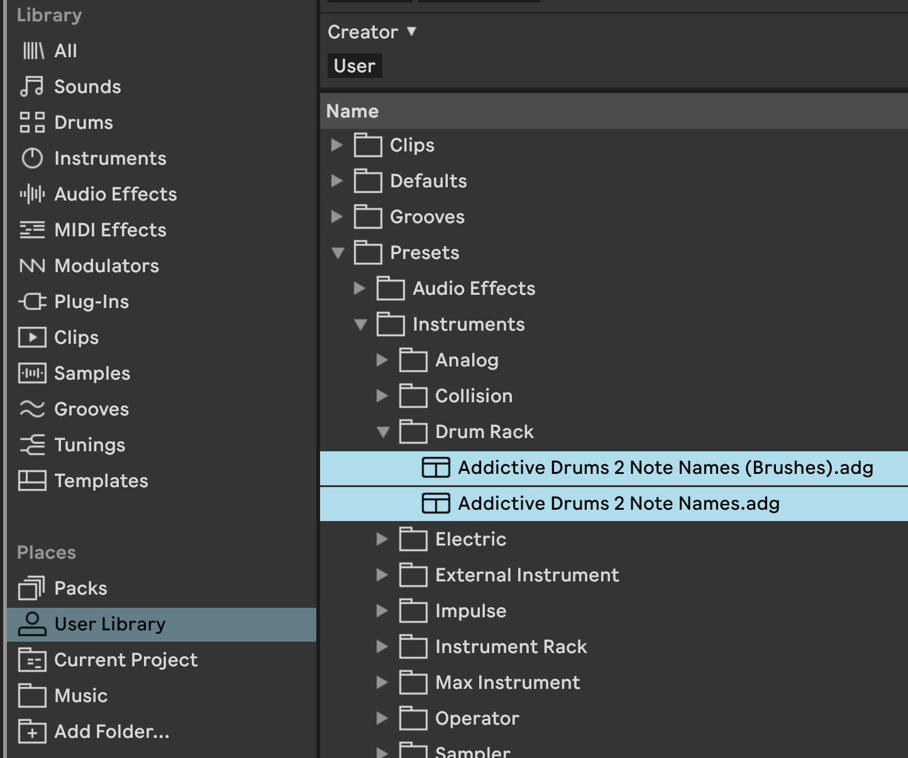
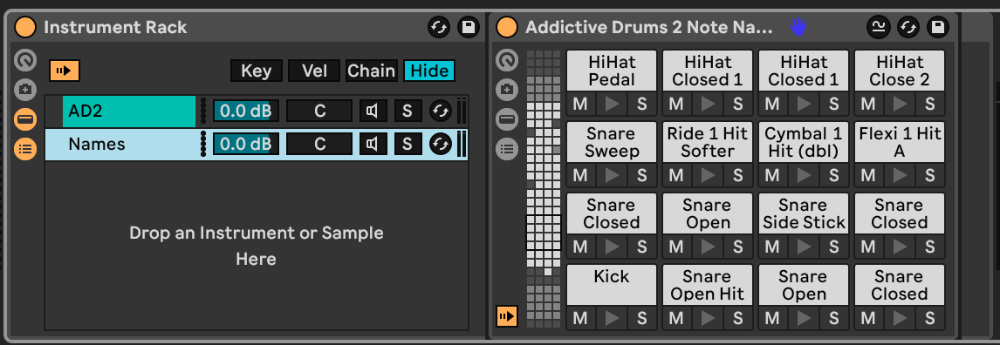
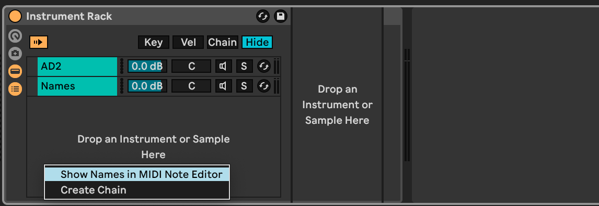

# Addictive Drums 2 Drum Racks for Ableton Live

These [Ableton Live Drum Rack](https://www.ableton.com/en/manual/instrument-drum-and-effect-racks/) devices label the notes in MIDI clips with the drum hit names as used by [XLN Audio Addictive Drums 2](https://www.xlnaudio.com/products/addictive_drums_2), instead of showing the rather useless MIDI note names.

These devices do not produce sound and are just a light-weight way to add drum names to MIDI clips. Without this device, the MIDI roll show notes like ‘C1’ and ‘F4’ (which is not very helpful); after adding this device, MIDI clips show ‘Kick’ and ‘Cymbal 1 Hit’ instead:

These drum rack devices use the full Addictive Drums default mapping (not ‘General MIDI’) to map notes to specific sounds. There are two versions: one that matches most AD2 drum kits (ADpaks) such as [‘Studio Pop’](https://www.xlnaudio.com/products/addictive_drums_2/adpak/studio_pop), and one for brushes such as [‘Modern Jazz Brushes’](https://www.xlnaudio.com/products/addictive_drums_2/adpak/modern_jazz_brushes). These devices do not need configuration inside Addictive Drums itself; see the official documentation for the full list of sounds.

## Installation

- Make sure you have both Ableton Live 12 and Addictive Drums installed.
- Download the two `.adg` files
- Move them into the ‘User Library’ inside Ableton Live; the easiest way is to drag and drop the files onto the right item in the ‘Library’ sidebar.

## Usage

- Create a MIDI track
- Add an empty ‘Instrument Rack’ device
- Add a first chain by dragging the Addictive Drums plugin into the instrument rack (VST3, AU, etc.); this chain produces the sound.
- Add a second chain by dragging the drum rack into the instrument rack; this chain adds the note names but produces no sound.

The end result looks like this:

Note: counterintuitively, the ‘Show Names in MIDI Note Editor’ option in the (right-click) context menu of the instrument rack should be *turned off* for these devices to work:

